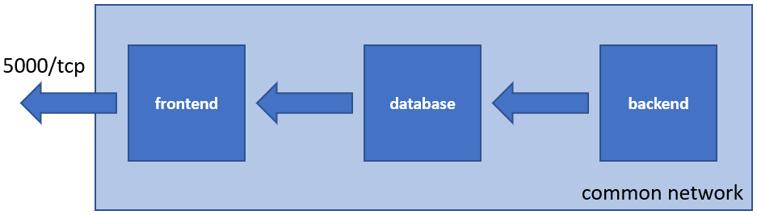

# Treasure Finding Contest
A simple project to be used for the final practice exam for the [**DevOps - Containerization, CI/CD & Monitoring (2022.02)**](https://softuni.bg/trainings/3670/devops-containerization-ci-cd-monitoring-february-2022) and [**DevOps - Containerization, CI/CD & Monitoring (2022.09)**](https://softuni.bg/trainings/3888/devops-containerization-ci-cd-monitoring-september-2022) courses at **SoftUni**. 

It is a set of three Docker containers, each with a dedicated role. Together they form a simple web application. 

The general setup looks like:



If the images have the following names (***img-frontend***, ***img-databse***, and ***img-backend***), and there is the ***app-net*** network present, then the correct commands to run the application in ***test mode*** *(published on port 8080)* would be:

```bash
# Run the frontend component
docker container run -d --name con-frontend --net app-net -p 8080:5000 img-frontend

# Run the database component
docker container run -d --name con-database --net app-net -e MYSQL_ROOT_PASSWORD='ExamPa$$w0rd' img-database

# Run the backend component
docker container run -d --name con-backend --net app-net img-backend

```

If all is set up corectly then the result would be something like this:


For successful completion of the challenge, you will have to create a pipeline that implements the following steps:
 - build the images;
 - run the containers in ***test mode*** (frontend published on port 8080)
 - test that the frontend is accessible;
 - publish the images to a registry (for example, Docker Hub);
 - run the application from the published images in ***production mode*** (frontend published on port 80);
 - ensure the containers are part of the same network.

Please note that:
 - each container should be named after the following rule - ***con-role***, where ***role*** is either ***frontend***, ***database***, or ***backend***. For example, ***con-frontend***;
 - database password is expected to be **ExamPa$$w0rd**. It can be changed via environment variables (***DB_PASS*** for the ***frontend*** and ***backend*** and ***MYSQL_ROOT_PASSWORD*** for the ***database***);
 - web content is delivered by the **frontend** on port **5000**. It may be redirected to an arbitrary port on the host, for example on port 80 or port 8080;
 - there is no particular order to follow when starting the containers.

*More specific details could be found in the downloadable **Practice Exam** document available in the **Retake Exam** section of the course.*
